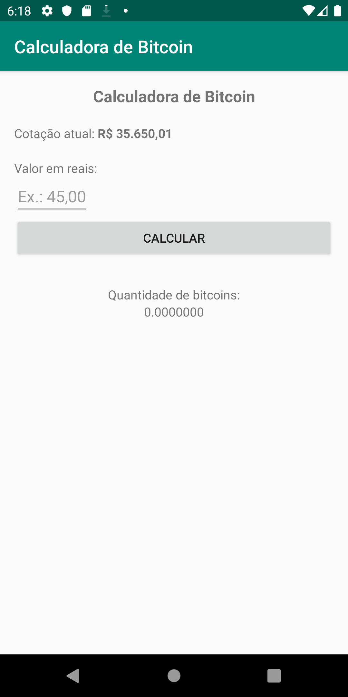
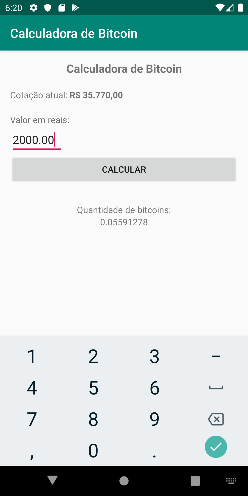

<h1>Calculadora de Bitcoin</h1>

Ao abrir o App a cotação atual de Bitcoin é carregada através da API do www.mercadobitcoin.net.

Contém um edit text para você informar o valor em reais e logo após ciclar no botão CALCULAR 
para saber o valor equivalente em bitcoins. 

<h3>Ao abrir o aplicativo.</h3>

<h3>Após valor informado e cálculo realizado.</h3>

 

